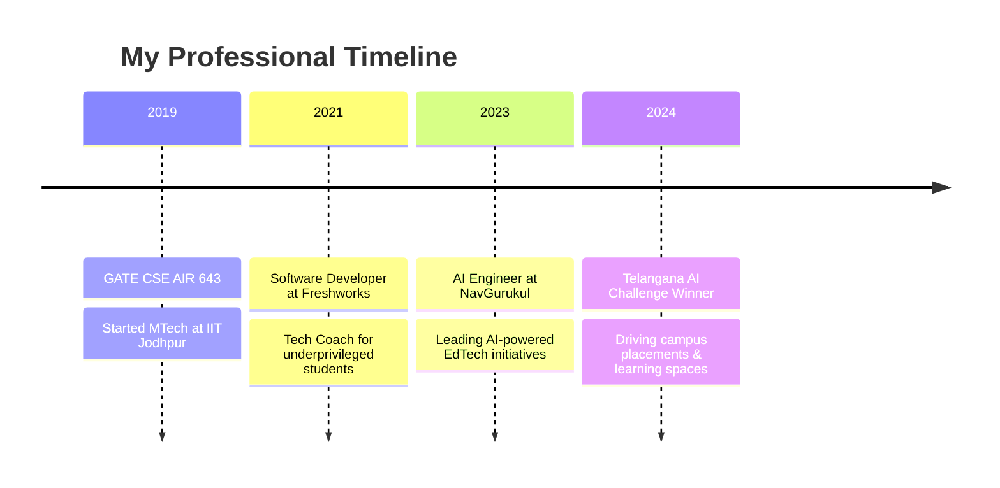

<div align="center">
  
# Hi there, I'm Vinit Gore! 👋

### 🤖 AI Engineer | 🎓 IIT Jodhpur Alumnus | 🌟 EdTech Innovator

*Building AI-powered solutions to transform education for underprivileged communities*

---

[](https://www.linkedin.com/in/vinitgore/)
[](mailto:vinitgore1234@gmail.com)
[](https://ai.navgurukul.org)

</div>

## 🚀 About Me

```python
class VinitGore:
    def __init__(self):
        self.role = "AI Engineer @ NavGurukul"
        self.education = "MTech Computer Science - IIT Jodhpur"
        self.gate_rank = "AIR 643 (99.36 percentile) - GATE 2019"
        self.mission = "Democratizing AI education for underprivileged youth"
        
    def current_focus(self):
        return {
            "project": "PDF_To_Markdown_MCP",
            "domain": "AI-powered document processing",
            "impact": "Enhancing educational content accessibility"
        }
    
    def skills(self):
        return {
            "languages": ["Python", "JavaScript", "Java"],
            "frameworks": ["React", "TensorFlow", "PyTorch"],
            "devops": ["Docker", "Kubernetes", "CI/CD"],
            "ai_ml": ["Deep Learning", "Computer Vision", "NLP", "Q-Learning"]
        }
```

## 🏆 Featured Achievements

### 🎯 **Telangana AI Challenge Winner**
Led the development of **Draw and Learn AI** - selected by Telangana Government among 50 startups!

### 📚 **AI EdTech Portfolio**
- **AI English Tutor** - Personalized language learning
- **Gondi Word Injector** - Preserving indigenous languages through AI
- **Draw and Learn AI** - Visual learning through AI recognition
- **Flowchart Learning Assistant** - Simplifying complex concepts
- **AI Labs Portal** - Comprehensive AI education platform

*🌐 Explore all projects at [ai.navgurukul.org](https://ai.navgurukul.org)*

## 💼 Professional Journey



## 🛠️ Tech Stack

<div align="center">

### Programming Languages


### AI/ML & Frameworks


### DevOps & Tools


</div>

## 📊 GitHub Stats

<div align="center">


</div>

## 🌟 Current Focus: PDF_To_Markdown_MCP

I'm currently working on **PDF_To_Markdown_MCP**, an innovative project that leverages AI to transform PDF documents into structured Markdown format, making educational content more accessible and processable for AI systems.

## 🎨 Beyond Code

When I'm not building AI solutions, you'll find me:

- ♟️ **Playing Chess** - Strategic thinking on and off the board
- 📚 **Reading & Poetry** - Exploring literature and creative expression  
- 🌍 **Cultural Exploration** - Discovering commonalities in Indian languages
- 🤝 **Volunteering** - Social and spiritual community activities
- 💭 **Philosophy** - Contemplating the intersection of technology and humanity

## 🤝 Let's Connect!

I'm always excited to collaborate on projects that create positive social impact, especially in:

- 🤖 **AI/ML Education Tools**
- 🌐 **EdTech for Underserved Communities** 
- 📱 **Innovative Learning Platforms**
- 🔬 **Research in AI Applications**

<div align="center">

### 🚀 Ready to make an impact together?

[](https://ai.navgurukul.org)
[](https://www.linkedin.com/in/vinitgore/)
[](mailto:vinitgore1234@gmail.com)

---

*"Technology is best when it brings people together and creates opportunities for those who need them most."*


</div>
